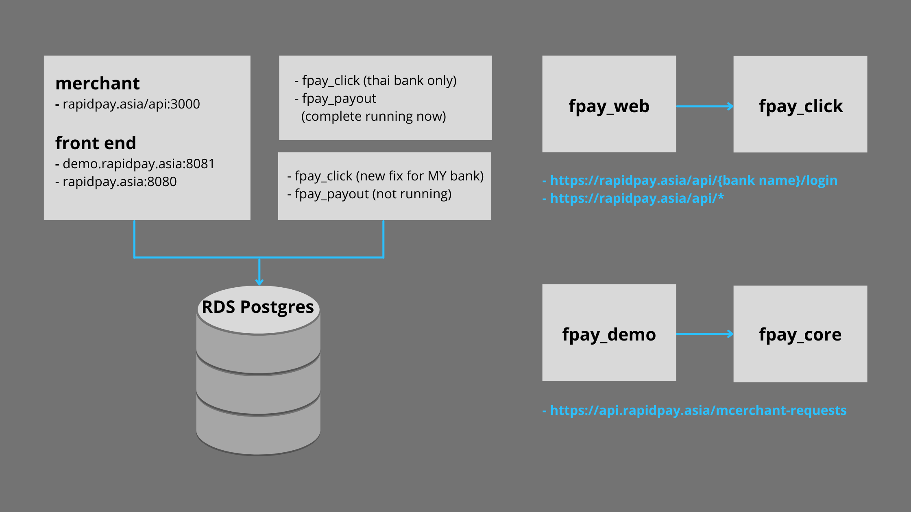

# Introduction

## Merchant Application Process

## Rapid Pay Payment Flow

1. Merchant calls FPay Core API with the `amount`.
2. Merchant sends request to **Rapid Pay** from the **Merchant Site**.
3. `bank id`, `token`, `login`, `username`, `password` are passed to **Rapid Pay Bank Transfer Site**.
4. Merchant will receive the OTP to complete the transaction.
5. Merchant will be redirected back to **Merchant Order Page** after getting the transaction status.
6. Merchant's customer will receive an email notification if the transaction is successful.

## Server

## Signature

### Merchant create request

Format : `Merchant code + merchant secret + ref id + amount`

:::caution
Amount need to remove . and ,
:::

Encryption hash : sha256

Example output : `3ZnJ3NXLWi1AiZgrPbHHrO80CNUiiupXwHLZS4+8nTg=`

### Response Signature (callback)

Format : `Merchant code + secret + payment id + ref id + amount + status`

:::caution
Amount need to remove . and ,
:::

Encryption hash: sha256

Example output: `3ZnJ3NXLWi1AiZgrPbHHrO80CNUiiupXwHLZS4+8nTg=`

## Rapid Pay URL Format

- Maybank : `maybank2u.rapidpay.asia`
- CIMB Bank : `cimbclick.rapidpay.asia`
- Hong Leong Bank : `hlb.rapidpay.asia`
- RHB Bank : `rhb.rapidpay.asia`

## API Rapid Pay URL

- fpay-core : `https://api.rapidpay.asia`
- fpay-click : `https://rapidpay.asia/api`

## Connection string used for database

:::note
Please send your request via **[WhatsApp](https://wa.me/60123550626)**.
:::
